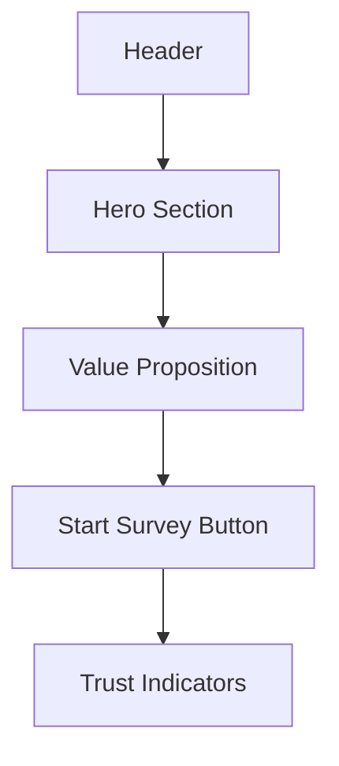
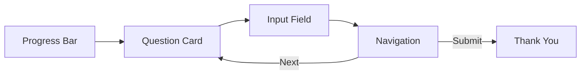
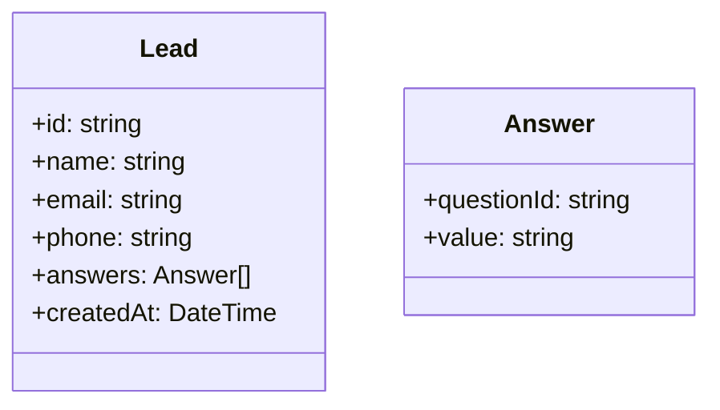

# Leads Management System (LMS) Implementation

## UX Wireframes

### Landing Page


### Survey Flow


## Component Design

1. **Question Card**:
```typescript
interface QuestionCardProps {
  question: string;
  description?: string;
  inputType: 'text' | 'radio' | 'checkbox';
  options?: string[];
  required: boolean;
}
```

2. **Progress Stepper**:
```typescript
interface StepperProps {
  currentStep: number;
  totalSteps: number;
  completedSteps: number[];
}
```

## Data Model


## Implementation Checklist
```markdown
- [ ] Create landing page components
- [ ] Design question card component
- [ ] Implement progress stepper  
- [ ] Build form state management
- [ ] Create API for lead submission
- [ ] Design thank you page
- [ ] Add analytics tracking