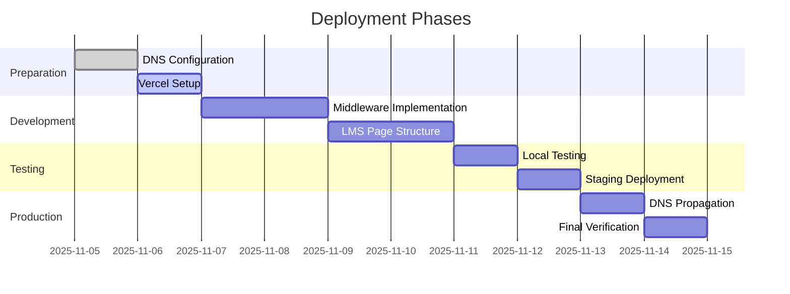

# LMS Subdomain Implementation Plan

[Previous sections remain unchanged...]

## Deployment Timeline


## Rollback Procedures
1. **DNS Rollback**:
   - Remove CNAME record
   - Update nameservers if needed

2. **Code Rollback**:
```bash
git revert HEAD # Undo last commit
vercel --prod   # Redeploy previous version
```

3. **Vercel Rollback**:
   - Use Vercel dashboard to revert to previous deployment

## Monitoring Setup
1. **Required Metrics**:
   - Subdomain traffic volume
   - Error rates (404s, 500s)
   - Response times

2. **Vercel Analytics**:
   - Enable in project settings
   - Set up alerts for errors

3. **Custom Monitoring**:
```typescript
// _middleware.ts
export function reportError(error: Error) {
  fetch('https://api.vercel.com/v1/events', {
    method: 'POST',
    headers: {
      'Authorization': `Bearer ${process.env.VERCEL_ANALYTICS_TOKEN}`
    },
    body: JSON.stringify({
      event: 'subdomain_error',
      payload: { error: error.message }
    })
  })
}
```

## Next Steps
1. Verify DNS access
2. Create LMS page templates
3. Implement middleware
4. Test locally
5. Deploy to staging