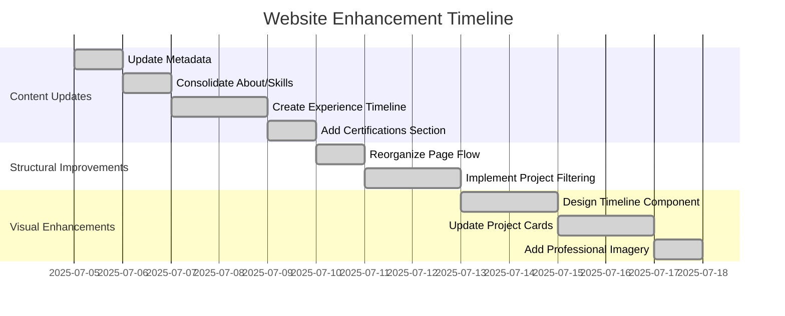

# Website Enhancement Implementation Plan

## Overview
Plan to improve professional showcase website with content updates, structural improvements, and visual enhancements.



## Phase 1: Content Updates (3-4 days)

### 1. Metadata Update
- File: `src/app/layout.tsx`
- Updates:
  ```typescript
  export const metadata: Metadata = {
    title: "Mark Salvador | Solutions Architect & Technology Leader",
    description: "15+ years experience designing enterprise systems..."
  };
  ```

### 2. Consolidated About/Skills
- Content consolidated from `Mark Salvador_CV2.pdf` and `old-Albie Mark Salvador.doc` into `docs/consolidated_resume_content.md`.
- This consolidated content will be used to merge duplicate sections and organize skills by:
  - Cloud Architecture
  - System Design
  - Leadership
  - Technologies

### 3. Experience Timeline
- Chronological component showing:
  - Key positions
  - Major projects
  - Technologies used

### 4. Certifications Section
- Professional certifications
- Education background
- Ongoing learning

## Phase 2: Structural Improvements (3 days)

### 1. Page Reorganization
New content flow:
1. Hero
2. Profile Summary
3. Experience Timeline
4. Skills Matrix
5. Featured Projects
6. Certifications
7. Portfolio
8. Contact

### 2. Project Filtering
- Add tags to projects
- Filter buttons by:
  - Technology
  - Project type
  - Year

## Phase 3: Visual Enhancements (5 days)

### 1. Timeline Component
- Interactive vertical timeline
- Expandable position details
- Technology badges

### 2. Enhanced Project Cards
- Screenshots/thumbnails
- Tech stack badges
- Outcome metrics

### 3. Professional Imagery
- High-quality headshots (implemented in Hero section)
- Custom illustrations (consider adding in future iterations)
- Technology icons (consider adding in future iterations)
- **Enhanced Experience Timeline with Imagery**: Added relevant images to timeline entries in `src/components/ExperienceTimeline.tsx`.